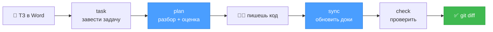

# 🧠 RepoMind

### Документация, которая обновляется сама — по коду, который ты только что написал

Память проекта для тебя и для твоего coding-агента. Живёт рядом с кодом,
обновляется по `git diff`, проверяется скриптами.

**Работает с Claude Code и Codex.** Пользоваться можно уже сегодня —
CLI ещё пишется, но скиллы готовы.

---

## 😤 Знакомо?

> В `docs/` написано, что отчёты сортируются по алфавиту. Это поменяли полгода назад.

- Новый разработчик читает доки и делает **неправильно**
- Claude Code читает доки и делает **неправильно**
- Ты не пишешь новые доки, потому что старые всё равно врут
- На каждую задачу руками собираешь контекст: где логика, что уже решали, почему так
- «А почему у нас Redis, а не Celery?» — и никто не помнит

Обновлять документацию руками никто не будет. **Значит, это должно происходить само.**

---

## ✨ Что делает RepoMind

**Обновляет документацию по твоему коду:**

```diff
  ## Сортировка по умолчанию
  <!-- block: REPORT.DEFAULT_SORTING -->

- Отчёты выводятся в порядке добавления.
+ Отчёты сортируются по дате начала периода по убыванию.
+ Записи без даты — в конце списка.
```

Три строки в diff. **Не переписанный файл на 600 строк.** Поменял сортировку —
обновился абзац про сортировку. Переименовал переменную — не обновилось ничего,
и правильно.

**И превращает ТЗ в готовый технический разбор:**

Кинул `.docx` в папку → получил разбор с путями к файлам, кодом, рисками,
планом и **оценкой в часах**. Не «список файлов», а то, с чем можно идти
работать. → [посмотреть пример](examples/demo-project/docs/tasks/DEMO-657/deep-dive.md)

---

## 🚀 Начать за 2 минуты

```bash
git clone https://github.com/portner-boop/project-memory
cd project-memory
./skills/install.sh /путь/к/твоему/проекту
```

Теперь открой свой проект в Claude Code или Codex и скажи:

```
/docs-init
```

Агент осмотрит проект, поймёт стек, задаст пару вопросов и развернёт структуру.
Команды в инструкциях возьмёт **из твоих же** `Makefile` и `package.json`.
Существующие файлы не тронет.

> В Codex то же самое через `$`: `$docs-init`

---

## 🔄 Как проходит задача



Синим — шаги, где работает модель. **Их всего два из шести.** Остальное —
обычные скрипты: быстро, бесплатно, одинаково каждый раз.

| Шаг | Что происходит | Кто работает |
|---|---|---|
| 1️⃣ `task` | Word → markdown, папка задачи | скрипт |
| 2️⃣ `plan` | разбор кода → deep-dive + оценка в часах | 🧠 модель |
| 3️⃣ разработка | агент идёт по плану, отмечает пункты | ты и агент |
| 4️⃣ `sync` | `git diff` → какие абзацы доков поправить | 🧠 модель |
| 5️⃣ применение | операции → markdown | скрипт |
| 6️⃣ `check` | битые ссылки, дубли ID, забытые файлы | скрипт |

---

## 📋 Команды

| Что нужно | Сегодня — скилл | Потом — CLI |
|---|---|---|
| 🔧 Поставить | `./skills/install.sh` | `uvx repomind init` |
| 📁 Развернуть структуру | `/docs-init` | `repomind init` |
| 📥 Завести задачу из ТЗ | `/docs-init` подскажет | `repomind task` |
| 🔍 Разбор + оценка | `/docs-plan ABC-123` | `repomind plan` |
| 🔄 Обновить документацию | `/docs-sync` | `repomind sync` |
| ✅ Проверить целостность | — | `repomind check` |
| 🗂 Пересобрать каталог | — | `repomind index` |

**Загрузка ТЗ — просто перетащить файл:**

```bash
# кинул ABSHTRUE-657.docx в docs/requirements/inbox/
repomind task
```

Номер задачи возьмётся из имени файла. Word, PDF, Excel — конвертируются,
оригинал сохранится рядом.

---

## ⚡ Почему это эффективно

**1. Расход зависит от размера правки, а не проекта**

В модель уходит только diff и **связанные с ним абзацы** документации.
Не весь репозиторий, не вся документация, не история git.

> На репозитории в миллион строк синк стоит столько же, сколько на десяти тысячах.

**2. Документация разбита на адресуемые блоки**

Агент правит блок `AUTH.REFRESH_TOKEN`, а не файл `architecture.md` целиком.
Меньше контекста, меньше риска переписать правильный текст, чище diff.

**3. Большинство коммитов не трогают документацию вообще**

Рефакторинг, форматирование, опечатка, тест — постоянные документы не меняются.
Только запись в результат задачи. Система молчит, когда сказать нечего.

**4. Модель не пишет в файлы**

Она возвращает **операции**, которые проверяются до применения:

| Проверка | Если не прошла |
|---|---|
| такой документ и абзац существуют? | ❌ отказ |
| формат ответа корректный? | ❌ переделать |
| функция из доказательства реально менялась? | ❌ **отказ** |

Последняя — защита от правдоподобного вранья. **Утверждение без доказательства
не применяется.** Не поняла намерение — пишет `needs_review`, а не догадку.

**5. Финальный контроль — обычный `git diff`**

Никакого отдельного интерфейса, который никто не откроет. Документация
ревьюится там же и так же, как код.

---

## 📦 Что внутри

```text
docs/
├── product/          что система делает
├── architecture/     как она устроена
├── contracts/        API и события
├── decisions/        ADR — почему так решили
├── runbook/          🔥 как запустить, чем тестировать, что делать когда сломалось
├── requirements/     ТЗ: inbox → original
├── tasks/<ID>/       разбор, оценка, ход работы, результат
└── _index.json       карта для агента
```

**Runbook** — то, что обычно живёт в головах и в чате. Агент берёт команды
оттуда, а не угадывает `npm test`. Записи «что делать, когда сломалось»
индексируются **по симптому** — человек ищет по тому, что видит на экране.

**ADR** — короткая запись «контекст → решение → последствия». Пишется, только
когда кто-то спросил «а почему тут так?». Не на каждый рефакторинг.

---

## 🔗 Что использует

**Сам инструмент:** Python, Typer, Pydantic, markdown-it-py, Jinja2,
`markitdown` для Word/PDF, git через subprocess. Без базы, без сервера.

**Соседи по желанию:**

| | Зачем | Обязательно? |
|---|---|---|
| [CodeGraph](https://github.com/colbymchenry/codegraph) | ищет задетые документы по графу вызовов, а не по маскам путей; удешевляет разбор кода | нет |
| Claude Code / Codex | выполняют скиллы | хотя бы один |

Про связку с CodeGraph — [docs/07-codegraph.md](docs/07-codegraph.md). Коротко:

```text
CodeGraph   ГДЕ код и как он связан     ← извлекается из кода
RepoMind    ПОЧЕМУ так и что делать     ← этого в коде нет никогда
```

`repomind init` поднимет его сам, если он установлен. Не установлен — просто
покажет команду и пойдёт дальше.

---

## 📊 Статус

| | |
|---|---|
| 🟢 Скиллы `init` / `plan` / `sync` | работают, [`skills/`](skills/) |
| 🟢 Концепция, модель данных, пример | готовы |
| 🟡 CLI `repomind` | не написан, [план в roadmap](docs/05-roadmap.md) |
| ⚪ Хуки, CI, Jira | спроектированы, включаются позже |

Три из шести команд CLI пишутся **вообще без ИИ** — с них и стоит начинать.

---

## 📚 Дальше

**Пользоваться:**

| | |
|---|---|
| 🚀 [skills/](skills/) | установка и `/docs-init` |
| 📄 [CHEATSHEET.md](CHEATSHEET.md) | одна страница со всем |
| 🎯 [examples/demo-project/](examples/demo-project/) | живой пример проекта целиком |

**Разобраться:**

| | |
|---|---|
| [01 — Как это работает](docs/01-concept.md) | агенты, контекст, скиллы и хуки — с нуля |
| [02 — Модель документации](docs/02-doc-model.md) | блоки, ADR, runbook, индекс |
| [03 — Полный цикл](docs/03-workflow.md) | от ТЗ до diff, синхронизация по шагам |
| [04 — CLI](docs/04-cli.md) | команды, загрузка Word, что создаёт `init` |
| [05 — Roadmap](docs/05-roadmap.md) | что писать первым |
| [06 — Миграция](docs/06-migration.md) | переезд с текущего процесса |
| [07 — CodeGraph](docs/07-codegraph.md) | связка, чтобы стало ещё дешевле |

---

<div align="center">

**Не генератор документации. Инкрементальная память проекта.**

</div>
