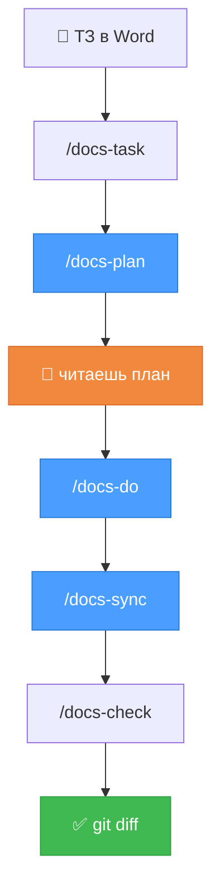

# 🧠 RepoMind

### Документация проекта, удобная человеку и агенту — и обновляющаяся сама

Не «файлы для нейросети» и не «вики, которую никто не открывает».
**Одна документация, которую одинаково удобно читать обоим** — и которая
не устаревает, потому что правится по `git diff`.

```bash
npx repomind-skills
```

Одна команда, ноль зависимостей, ничего не ставится глобально. Работает
с **Claude Code** и **Codex**, а в паре с [CodeGraph](#-работает-в-паре-с-codegraph)
находит устаревшие абзацы по графу вызовов, а не по маскам путей.

---

## 😤 Знакомо?

> В `docs/` написано, что отчёты сортируются по алфавиту. Это поменяли полгода назад.

**В работе команды:**

- Порядок запуска проекта живёт в переписке, а не в репозитории
- Обоснование давнего решения нигде не зафиксировано и восстанавливается заново
- Оценка похожей задачи считается с нуля каждый раз
- Новую документацию писать нет смысла, пока старая расходится с кодом

**В работе агента:**

- Читает ту же расходящуюся документацию и действует по ней
- На каждую задачу заново обходит репозиторий
- Подбирает команду запуска вместо того, чтобы взять принятую в проекте

Проблема общая: **знание есть, но оно в головах и в переписке.**
А обновлять документацию руками никто не будет — значит, это должно
происходить само.

---

## ✨ Что делает RepoMind

**Обновляет документацию по твоему коду:**

```diff
  ## Сортировка по умолчанию
  <!-- block: REPORT.DEFAULT_SORTING -->

- Отчёты выводятся в порядке добавления.
+ Отчёты сортируются по дате начала периода по убыванию.
+ Записи без даты — в конце списка.
```

Три строки в diff. **Не переписанный файл на 600 строк.** Поменял сортировку —
обновился абзац про сортировку. Переименовал переменную — не обновилось ничего,
и правильно.

**И превращает ТЗ в готовый технический разбор:**

Кинул `.docx` в папку → получил разбор с путями к файлам, кодом, рисками,
планом и **оценкой в часах**. Не «список файлов», а то, с чем можно идти
работать. → [посмотреть пример](examples/demo-project/docs/tasks/DEMO-657/deep-dive.md)

---

## 👥 Одна документация — два читателя

Обычно приходится выбирать: либо вики для людей, либо структурированный корм
для модели. Здесь один и тот же набор документов обслуживает обоих — потому
что построен на трёх инженерных свойствах, а не на дисциплине.

### Три свойства, на которых всё держится

**Проверяемость.** Каждое утверждение о коде несёт ссылку `path#Symbol`.
Ссылка либо резолвится, либо нет — это проверяется механически. Документ не
может утверждать то, чего в коде не существует.

**Самопроверка.** `/docs-check` прогоняет двенадцать правил: битые ссылки на
код, дубли идентификаторов, расхождения индекса, протухшие подтверждения,
конфликтующие решения. Целостность обеспечивается прогоном, а не памятью —
и встраивается в pre-commit или CI.

**Автономность.** Обновление документации привязано к `git diff`, а не к
намерению вспомнить. Изменение доезжает до документации в том же PR, что
и код, либо не доезжает вовсе — и тогда проверка это показывает.

### Что это даёт каждому

| Элемент | 🧑 Человеку | 🤖 Агенту |
|---|---|---|
| **Адресуемые блоки** | изменение локализовано: в ревью три строки вместо файла на 600 | грузит один блок, а не весь документ |
| **`code_paths` — связь с кодом** | зависимость документа от кода задана явно и машиночитаемо | отбирает нужное за один шаг |
| **ADR** | обоснование решения переживает смену состава команды | не предлагает заново то, от чего уже отказались |
| **Runbook** | команды собраны в одном месте и сверяются с проектом автоматически | берёт настоящие команды вместо угадывания |
| **Troubleshooting** | известные отказы разобраны один раз, а не расследуются повторно | тот же разбор доступен ему |
| **Разбор + оценка** | оценка с разбивкой и явными допущениями — защищаемая, а не «на глаз» | план работ, по которому идёт реализация |
| **Граф вызовов** (CodeGraph) | видно транзитивное влияние правки | находит задетые документы точно, а не по маскам |
| **`summary.md`** | одна согласованная формулировка результата для всех сторон | — |
| **`_index.json`** | — | карта всей документации в одном файле |
| **`git diff`** | ревью идёт в существующем процессе, без второго инструмента | — |

Главное следствие: **документация перестаёт расходиться с кодом
автоматически, а не потому, что кто-то за этим следит.** Ровно поэтому её
снова имеет смысл читать.

---

## 🚀 Начать за 2 минуты

**1. Поставить скиллы** — в папке своего проекта:

```bash
npx repomind-skills
```

**2. Поставить CodeGraph** — необязательно, но с ним заметно лучше:

```bash
npm i -g @colbymchenry/codegraph
```

**3. Развернуть структуру** — открой проект в агенте и скажи:

```
/docs-init
```

Агент осмотрит проект, поймёт стек, задаст пару вопросов и развернёт структуру.
Команды в инструкциях возьмёт **из твоих же** `Makefile` и `package.json`.
CodeGraph, если он есть, поднимет сам. Существующие файлы не тронет.

**4. Описать архитектуру по коду** — он предложит это сам на шаге 3, либо:

```
/docs-describe
```

На выходе — архитектура и контракты API, написанные **по твоему коду**, где
каждое утверждение со ссылкой `path#Symbol`. Плюс список вопросов «похоже на
осознанное решение, но из кода причина не следует» — ответишь, станут ADR.

> В Codex всё то же самое через `$`: `$docs-init`, `$docs-describe`

---

## 🔄 Как проходит задача



Оранжевым — **ты**. Единственное место, где нужно остановиться и почитать.
Синим — где работает модель.

| Шаг | Что происходит |
|---|---|
| 📥 `/docs-task` | Word → markdown, папка задачи, ID из имени файла |
| 🔍 `/docs-plan` | разбор кода → deep-dive + оценка в часах |
| 👀 **ты** | **читаешь план, правишь если не согласен** |
| ⚙️ `/docs-do` | выполняет план по одному пункту, отмечает прогресс |
| 🔄 `/docs-sync` | `git diff` → какие абзацы документации поправить |
| ✅ `/docs-check` | битые ссылки на код, дубли ID, забытые файлы |

**Про прочитку плана.** `/docs-do` не начнёт, пока в шапке `deep-dive.md`
не стоит `reviewed: true`. Это не бюрократия, а арифметика: **прочитать две
страницы разбора — пять минут, выяснить то же самое после реализации —
полдня.** Не согласен — правишь прямо в файле, агент пойдёт по исправленному.

**Про `/docs-do`.** Делает один пункт за раз и отмечает в `progress.md` сразу,
а не в конце: прервался — продолжит с того же места. Понял, что пункт неверен —
останавливается и спрашивает, а не переписывает план молча.

---

## 📋 Семь скиллов

| Скилл | Что делает | Когда |
|---|---|---|
| `/docs-init` | развернуть структуру под твой стек | один раз на проект |
| `/docs-describe` | описать архитектуру и API **по коду** | при `init`, потом по модулям |
| `/docs-task` | ТЗ из Word → папка задачи | приехало ТЗ |
| `/docs-plan ABC-123` | разбор кода, план, оценка в часах | начало задачи |
| `/docs-do` | выполнить план по шагам | реализация |
| `/docs-sync` | обновить документацию по diff | после реализации |
| `/docs-check` | валидация + пересборка каталога | перед коммитом |

Скиллы — **обычные markdown-файлы с инструкцией**. Они копируются в твой
проект и дальше они твои: правь под свой процесс, коммить в git, ревьюй в PR.
Никакой скрытой магии, всё лежит на диске.

Без аргументов команды берут текущую задачу из `docs/now/current-task.md`.
В Codex то же самое через `$`: `$docs-plan ABC-123`.

С CodeGraph рядом первые два шага дешевеют в разы — вместо десятков чтений
файлов один запрос к графу. См. [раздел про связку](#-работает-в-паре-с-codegraph).

**Загрузка ТЗ — просто перетащить файл:**

```text
1. кинул ABSHTRUE-657.docx в docs/requirements/inbox/
2. сказал агенту:  /docs-task
```

Номер задачи возьмётся из имени файла. Word, PDF, Excel — конвертируются,
оригинал сохранится рядом.

---

## ⚡ Почему это работает

### 🧑 Что делает её пригодной для работы

**Расхождение с кодом ловится до мержа.** Документация правится в том же PR,
что и код, и проходит проверку: битые ссылки на символы, дубли
идентификаторов, недостающие файлы. Утверждение, которое не подтверждается
кодом, до основной ветки не доходит.

**Нет шума в ревью.** Рефакторинг, форматирование, тест — постоянные документы
не меняются вообще. Изменение документации в PR означает, что действительно
изменилось поведение, контракт или данные.

**Ревью привычное.** Обычный `git diff` в обычном PR. Никакого отдельного
интерфейса, который никто не откроет.

**Формат рассчитан на чтение.** Runbook — исполняемые команды. Troubleshooting —
индексация по наблюдаемому признаку отказа. ADR — три абзаца вместо документа
на восемь страниц. Ничего из этого не требует отдельного инструмента просмотра.

### 🤖 Чтобы агенту было дёшево и точно

**1. Расход зависит от размера правки, а не проекта**

В модель уходит только diff и **связанные с ним абзацы** документации.
Не весь репозиторий, не вся документация, не история git.

> На репозитории в миллион строк синк стоит столько же, сколько на десяти тысячах.

**2. Документация разбита на адресуемые блоки**

Агент правит блок `AUTH.REFRESH_TOKEN`, а не файл `architecture.md` целиком.
Меньше контекста, меньше риска переписать правильный текст, чище diff.

**3. На рефакторинге модель вообще не вызывается**

Классификация изменений — короткое замыкание: «это только рефакторинг» →
дальше не идём. Дорогой шаг просто не случается.

**4. Модель не пишет в файлы**

Она возвращает **операции**, которые проверяются до применения:

| Проверка | Если не прошла |
|---|---|
| такой документ и абзац существуют? | ❌ отказ |
| формат ответа корректный? | ❌ переделать |
| функция из доказательства реально менялась? | ❌ **отказ** |

Последняя — защита от правдоподобного вранья. **Утверждение без доказательства
не применяется.** Не поняла намерение — пишет `needs_review`, а не догадку.

Это и есть то, из-за чего документации снова можно верить: она не может
пополниться выдумкой, которую через полгода примут за правду.

---

## 📦 Что внутри

Обычные markdown-файлы. Открываются в любом редакторе, читаются глазами,
живут в твоём репозитории.

```text
docs/
├── product/          что система делает                    🧑 🤖
├── architecture/     как она устроена                      🧑 🤖
├── contracts/        API и события                         🧑 🤖
├── decisions/        ADR — почему так решили               🧑 🤖
├── runbook/          🔥 как запустить и что делать,
│                        когда сломалось                    🧑 🤖
├── requirements/     ТЗ: inbox → original                  🧑
├── tasks/<ID>/       разбор, оценка, ход работы, результат  🧑 🤖
└── _index.json       карта документации                    🤖
```

Один машиночитаемый файл на всю систему — `_index.json`, и тот генерируется
скриптом. **Всё остальное написано для людей.**

**Runbook** — то, что обычно живёт в переписке: порядок запуска, команды
тестов и линтеров, миграции, выкатка. Один источник правды и для человека,
и для агента. Записи «что делать, когда сломалось» индексируются
**по симптому** — по наблюдаемому признаку отказа, а не по его названию,
поэтому находятся во время инцидента, а не после.

**ADR** — короткая запись «контекст → решение → последствия». Три абзаца.
Фиксирует то, чего нет в коде: почему выбран этот вариант и что отвергнуто.
Пишется на архитектурное решение, не на рефакторинг.

---

## 🔗 Работает в паре с CodeGraph

Это не «поддерживается», а **основной режим**, ради которого стоит поставить оба.

Два слоя знания, которые не пересекаются:

```text
┌────────────────────────────────────────────────┐
│  RepoMind    ПОЧЕМУ так и что с этим делать    │ ← нет в коде никогда
│              решения, требования, процесс      │
├────────────────────────────────────────────────┤
│  CodeGraph   ГДЕ код и как он связан           │ ← извлекается из кода
│              символы, вызовы, зависимости      │
└────────────────────────────────────────────────┘
```

[CodeGraph](https://github.com/colbymchenry/codegraph) индексирует код в
локальный граф символов и вызовов. Заявленная экономия сама по себе — **47%
токенов и 58% вызовов инструментов**. RepoMind использует его в четырёх местах:

| Где | Без CodeGraph | С CodeGraph |
|---|---|---|
| `/docs-describe` — разбор кода | десятки чтений файлов | `codegraph explore` — один запрос |
| `/docs-plan` — сбор «как работает сейчас» | то же | то же |
| **`/docs-sync` — что задето правкой** | **маски путей, с промахами** | **граф вызовов, транзитивно** |
| `/docs-check` — проверка ссылок на код | текстовый поиск | запрос к графу символов |

**Третья строка — главная, и она не про деньги, а про правильность.**
Маски путей пропускают транзитивные изменения:

```text
Поменяли:   backend/app/common/periods.py#overlaps
Маска:      backend/app/report/**   → не совпало → документ пропущен
Реальность: расчёт отчётов вызывает overlaps → документ теперь ВРЁТ
```

Граф это ловит. Маски — нет, никогда.

### Как включить

```bash
npm i -g @colbymchenry/codegraph
```

Дальше ничего делать не надо: `/docs-init` увидит его и поднимет сам —
построит индекс, пропишет MCP для Claude Code и Codex, добавит `.codegraph/`
в `.gitignore`. Не установлен — покажет команду и спокойно пойдёт дальше.

**Зависимость необязательная.** Нет графа — всё работает на масках путей:
грубее, но всегда. Подробности и матрица состояний —
[docs/07-codegraph.md](docs/07-codegraph.md).

---

## 📦 Пакет

```bash
npx repomind-skills
```

| | |
|---|---|
| Размер | 31 kB, 15 файлов |
| Зависимости | **ноль** |
| Что ставит глобально | **ничего** |
| Что кладёт в проект | семь `.md` с инструкциями + symlinks |

**После установки скиллы твои.** Обычные markdown-файлы в твоём репозитории:
правь под свой процесс, коммить в git, ревьюй в PR. Пакет — это доставка,
а не рантайм: удалишь npm — скиллы продолжат работать.

**Обновление не затирает правки.** Установщик запоминает, что положил, и при
следующем запуске обновляет только то, чего ты не касался:

```text
⟳  docs-plan — обновлён
⚠  docs-init — ты его правил, не трогаю
=  docs-sync
```

Хочешь взять версию из пакета поверх своей — `--force`.

---

## 📊 Статус

| | |
|---|---|
| 🟢 npm-пакет `repomind-skills` | опубликован, ставится одной командой |
| 🟢 Семь скиллов: init, describe, task, plan, do, sync, check | работают |
| 🟢 Связка с CodeGraph | `/docs-init` поднимает сам |
| 🟢 Концепция, модель данных, пример | готовы |
| ⚪ Хуки, CI, интеграция с Jira | спроектированы, [включаются позже](docs/05-roadmap.md) |

**Никаких API-ключей и второго счёта.** Думает тот агент, за которого ты уже
платишь: скиллы — это инструкции для него, а не отдельная программа с моделью
внутри.

---

## 📚 Дальше

**Пользоваться:**

| | |
|---|---|
| 🚀 [skills/](skills/) | установка и `/docs-init` |
| 📄 [CHEATSHEET.md](CHEATSHEET.md) | одна страница со всем |
| 🎯 [examples/demo-project/](examples/demo-project/) | живой пример проекта целиком |

**Разобраться:**

| | |
|---|---|
| [01 — Как это работает](docs/01-concept.md) | агенты, контекст, скиллы и хуки — с нуля |
| [02 — Модель документации](docs/02-doc-model.md) | блоки, ADR, runbook, индекс |
| [03 — Полный цикл](docs/03-workflow.md) | от ТЗ до diff, синхронизация по шагам |
| [04 — Скиллы](docs/04-skills.md) | что делает каждый, загрузка Word, что создаёт `init` |
| [05 — Roadmap](docs/05-roadmap.md) | что писать первым |
| [06 — Миграция](docs/06-migration.md) | переезд с текущего процесса |
| [07 — CodeGraph](docs/07-codegraph.md) | связка, чтобы стало ещё дешевле |

---

<div align="center">

**Не генератор документации и не корм для нейросети.**
**Живая память проекта — одна на человека и на агента.**

</div>
