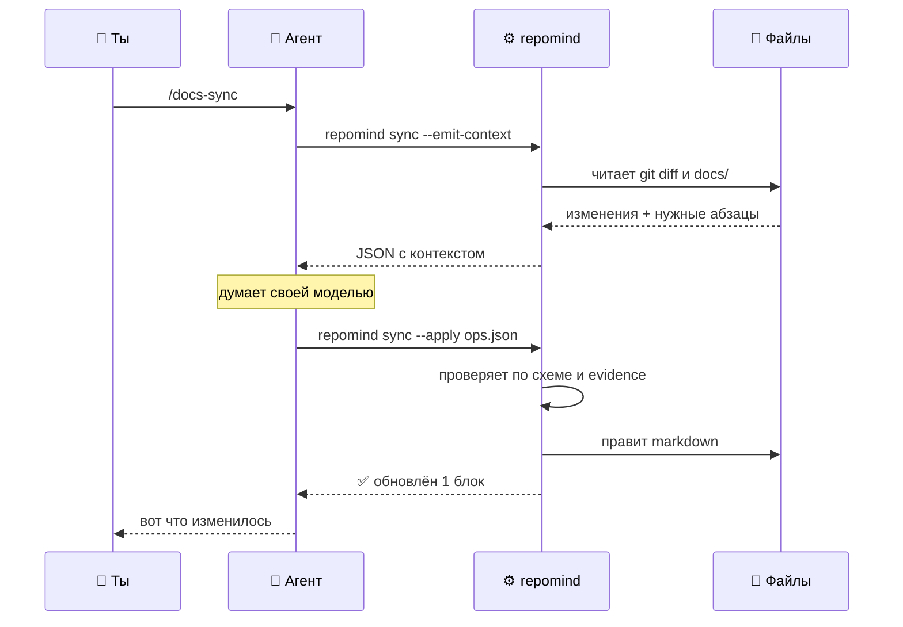

# 08 — Как устроен CLI

---

## Сначала главное: CLI — это программа, которую запускает твой агент

Как `git`. Как `npm`. Как `pytest`.

Твой агент — Claude Code или Codex — умеет **запускать команды в терминале**.
Он это и так делает постоянно: `git status`, `npm test`, `ls`. Появится
`repomind` — просто ещё одна команда, которую он умеет запускать.

```text
        ТЫ
         │  пишешь /docs-sync
         ▼
   ┌───────────────┐
   │  АГЕНТ        │  у него есть: модель (думать) и терминал (руки)
   │  Claude Code  │
   └───┬───────────┘
       │ запускает команду
       ▼
   ┌───────────────┐
   │  repomind     │  обычная программа: читает файлы, печатает текст
   └───────────────┘  модели внутри НЕТ
```

**Модель одна — та, что уже работает в твоём агенте.** CLI её не заменяет,
не дублирует и никуда не ходит по сети.

## Как выглядит один запуск, по шагам

Ты написал `/docs-sync`. Дальше всё делает агент — вот что именно:

```text
1. Агент открывает .claude/skills/docs-sync/SKILL.md
   Там написано: «сначала запусти repomind sync --emit-context»

2. Агент выполняет в терминале:
       repomind sync --emit-context > /tmp/ctx.json

   repomind в это время: смотрит git diff, читает docs/_index.json,
   находит подходящие абзацы, складывает всё в один JSON. Печатает его.
   Ни в какой API не ходит.

3. Агент читает /tmp/ctx.json обычным чтением файла.
   Теперь у него в контексте: что изменилось в коде и какие абзацы
   документации могли устареть.

4. Агент ДУМАЕТ — своей моделью, той самой, которой он отвечает тебе.
   Решает, какие абзацы поправить и как.

5. Агент записывает ответ в файл:
       /tmp/ops.json

6. Агент выполняет:
       repomind sync --apply /tmp/ops.json

   repomind проверяет ответ по схеме, сверяет ссылки на код с diff
   и правит markdown. Печатает, что сделал.

7. Агент показывает тебе результат.
```

Всё. Шесть действий агента и два запуска обычной программы.



## Кто что умеет

| | 🤖 Агент | ⚙️ repomind |
|---|:---:|:---:|
| думать, понимать смысл текста | ✅ | ❌ |
| запускать команды в терминале | ✅ | — |
| читать и писать файлы | ✅ | ✅ |
| собрать `git diff` и найти нужные документы | 🐌 медленно и неточно | ✅ быстро и одинаково |
| проверить ответ по схеме | 🐌 может пропустить | ✅ строго |
| аккуратно заменить абзац в markdown | 🐌 может задеть соседний | ✅ точно |
| ходить в API модели | — | **никогда** |

Отсюда и разделение: **агент думает, CLI делает механику.**

## Почему не «CLI сам всё делает»

Потому что тогда ему нужен **свой API-ключ и свой счёт**. У тебя уже оплачен
Claude Code — платить второй раз за ту же самую модель незачем.

Плюс: у Claude Code, Codex и Cursor разные SDK. Пришлось бы поддерживать
каждый. А так под нового агента пишется **только `SKILL.md`** — код CLI
не трогается вообще.

## А если агента нет вообще

Четыре команды из семи модель не используют и работают сами по себе:

```bash
repomind init      # развернуть структуру
repomind task      # ТЗ из Word → папка задачи
repomind check     # валидация
repomind index     # пересобрать каталог
```

Их можно ставить в git-хук и в CI без всякого ИИ.

Три команды (`plan`, `do`, `sync`) без агента не работают — им нужно, чтобы
кто-то подумал. В CI для этого запускают агента в headless-режиме:
`claude -p` или `codex exec`.

---

## Тот же вопрос, но подробнее: кто вызывает модель

От этого зависит вообще всё — установка, биллинг, работа в CI, поддержка разных
агентов. Есть три варианта.

### Вариант А. CLI сам ходит в API

```text
repomind sync  →  Anthropic API  →  ответ  →  применить
                  (нужен API-ключ)
```

| Плюсы | Минусы |
|---|---|
| работает без агента, годится для CI | **нужен API-ключ у каждого разработчика** |
| полный контроль над промптом | отдельный счёт, помимо подписки на Claude Code |
| | у каждого агента свой SDK — поддерживать несколько |

Главная проблема — деньги. У человека уже оплачен Claude Code, а тут просят
завести ещё и API-ключ и платить второй раз за то же самое.

### Вариант Б. CLI не ходит в модель вообще ⭐

```text
агент → repomind sync --emit-context   → CLI собирает контекст, печатает JSON
      → агент сам думает                 (моделью, которая у него уже есть)
      → repomind sync --apply < ops.json → CLI проверяет и применяет
```

CLI становится **детерминированной частью**: собрать, проверить, применить.
Думает агент — той подпиской, которая у пользователя уже оплачена.

| Плюсы | Минусы |
|---|---|
| **никаких API-ключей** | без агента не работает |
| один CLI на все агенты — Claude Code, Codex, Cursor | в CI нужен headless-агент |
| платишь один раз, подпиской | |
| промпт живёт в скилле — правится без релиза CLI | |
| CLI тестируется без сети и без модели | |

### Вариант В. Гибрид

По умолчанию Б. Если найден `ANTHROPIC_API_KEY` — можно и напрямую, для CI.

### Что выбираем

**Вариант Б как основной, В как опция позже.**

Именно это ты и предложил: один CLI на всех агентов, а скилл — тонкая
прослойка, которая объясняет агенту, как с ним разговаривать. Это правильно,
и вот почему:

> Скрипт хорошо умеет то, что должно быть **одинаковым каждый раз**: собрать
> diff, найти документы, проверить схему, записать файл.
> Модель нужна ровно там, где надо **понять смысл**.
> Смешивать их в одном процессе незачем.

---

## Протокол: что именно лежит в JSON

Две команды на каждый умный шаг, между ними — обычный JSON.
Формат того, что CLI отдаёт агенту:

```bash
repomind sync --emit-context
```

```json
{
  "task": "ABSHTRUE-657",
  "diff": "diff --git a/backend/... ",
  "changed_symbols": ["backend/app/report/service.py#ReportService.get_all"],
  "candidate_documents": [
    {
      "id": "PRODUCT-REPORTS",
      "blocks": {
        "REPORT.DEFAULT_SORTING": "Отчёты выводятся в порядке добавления."
      }
    }
  ],
  "plan": "…содержимое deep-dive.md…",
  "response_schema": { "…JSON Schema…" }
}
```

Никакой сети. Только git, файлы и (если есть) CodeGraph. Обрати внимание на
`response_schema` — CLI сам говорит агенту, в каком виде ждёт ответ.

Обратно:

```bash
repomind sync --apply operations.json
```

Проверяет схему, существование документов и блоков, `evidence` против diff.
Не прошло — **отказ с понятной ошибкой**, файлы не тронуты.

### Почему это удобно

- **Промпт живёт в скилле**, а не в коде CLI. Поправил формулировку — не нужно
  выпускать новую версию пакета.
- **CLI тестируется без модели.** Подал фикстуру-JSON, проверил, что применилось
  правильно. Обычные юнит-тесты, никаких моков API.
- **Отладка человеком.** `--emit-context > ctx.json` — и видно ровно то, что
  уйдёт в модель. Никакой магии.
- **Новый агент подключается за час** — надо написать один `SKILL.md`, код CLI
  не трогается.

---

## Где живёт CLI

### Установка

```bash
pipx install repomind      # насовсем, в изолированное окружение
uvx repomind init          # разово, без установки
```

Обычный Python-пакет на PyPI. Ничего экзотического.

### Что где лежит

| Путь | Что | В git |
|---|---|---|
| `~/.local/pipx/venvs/repomind/` | сам пакет | — |
| `<проект>/.repomind/config.yml` | настройки проекта | ✅ |
| `<проект>/.repomind/dirty` | маркер «были правки» | ❌ |
| `<проект>/docs/**` | вся документация | ✅ |
| `<проект>/.agents/skills/**` | скиллы | ✅ |

**Никакой глобальной базы и никакого состояния между запусками.** Всё, что
знает CLI, лежит в репозитории проекта. Снёс пакет — данные целы. Клонировал
репозиторий на другой машине — всё на месте.

Это осознанно: инструмент не должен быть единственным местом, где живёт знание.

---

## Структура кода

```text
repomind/
├── cli.py                Typer: разбор аргументов, шесть команд
├── config.py             чтение .repomind/config.yml
│
├── docs/
│   ├── frontmatter.py    парсинг YAML-шапки
│   ├── blocks.py         поиск и замена блоков <!-- block: … -->
│   ├── index.py          сборка _index.json
│   └── apply.py          применение операций к markdown
│
├── code/
│   ├── git.py            diff, изменённые файлы, символы
│   ├── classify.py       поведение / контракт / рефакторинг
│   └── codegraph.py      обёртка, необязательная
│
├── ingest/
│   └── convert.py        docx / pdf / xlsx → markdown
│
├── checks/
│   └── rules.py          все проверки check
│
├── protocol/
│   ├── context.py        сборка JSON для агента
│   └── operations.py     валидация и применение ответа
│
└── templates/            Jinja2: болванки документов и скиллы для init
```

Ни одного места, где нужен HTTP-клиент к модели.

---

## Сколько это работы

Честная оценка по частям. Ничего сложного тут нет — сложное отдано модели.

| Часть | Что делает | Сложность | Модель |
|---|---|---|:---:|
| `index` | обойти `docs/`, собрать frontmatter | **полдня** | ❌ |
| `check` | список проверок | **день** | ❌ |
| `init` | разложить шаблоны, симлинки | **день** | ❌ |
| `task` | конвертация docx, создание папки | **день** | ❌ |
| `blocks.py` + `apply.py` | найти и заменить блок | **день** | ❌ |
| `protocol/` | собрать контекст, проверить ответ | **1–2 дня** | ❌ |
| `sync` | склейка всего вместе | **день** | ⭐ |
| `plan` | то же, другой контекст | **полдня** | ⭐ |
| `do` | выполнение плана по шагам | **1–2 дня** | ⭐ |

Итого **порядка двух недель** на аккуратную первую версию. Больше половины —
это работа с текстом и файлами, где нет ничего непредсказуемого.

Самая коварная часть — не модель, а **надёжная замена блока в markdown**:
найти маркер, определить границу до следующего заголовка того же уровня,
не поломать вложенные списки и кодовые блоки. Здесь нужны нормальные тесты.

---

## Порядок написания

Снизу вверх, чтобы на каждом шаге было что показать.

```text
1. index      обошёл docs/, собрал JSON            полдня, сразу видна польза
2. check      проверки поверх индекса              день, ловит реальные ошибки
3. blocks     чтение и замена блока + тесты        день, ядро всей системы
4. init       шаблоны и симлинки                   день
5. task       docx → markdown → папка задачи       день
   ─── тут уже можно жить: структура работает, проверки ловят ───
6. protocol   emit-context / apply                 1–2 дня
7. sync       первая команда с моделью             день
8. plan       второй промпт                        полдня
9. do         пошаговое выполнение                 1–2 дня
```

После пятого шага система уже приносит пользу без всякого ИИ. Модель
подключается к готовому и оттестированному скелету — это сильно проще, чем
начинать с неё.

---

## Как скилл разговаривает с CLI

Скилл после появления CLI становится **тонким**: он больше не объясняет, как
собрать контекст руками, а просто вызывает команды.

```md
## Steps

1. Run `repomind sync --emit-context > /tmp/ctx.json`
2. Read the file. It contains the diff, the candidate documentation blocks
   and the response schema.
3. Produce operations conforming to `response_schema`.
   Every operation must carry `evidence`.
4. Write them to `/tmp/ops.json`.
5. Run `repomind sync --apply /tmp/ops.json`
6. If the command reports validation errors — fix and repeat step 5.
```

Шесть строк вместо ста. Логика уехала в код, в скилле осталась только
инструкция «как думать».

**До появления CLI** скиллы делают всё сами — читают git, ищут документы,
правят файлы. Работает медленнее и не так строго, но работает. Поэтому
[`skills/`](../skills/) полезны уже сегодня, а переход на CLI потом будет
незаметным: команды те же, меняется только внутренность скилла.

---

## Что осознанно НЕ делаем в первой версии

| | Почему |
|---|---|
| прямые вызовы API | пользователь уже платит за агента |
| собственный MCP-сервер | скилл + CLI покрывают всё, MCP добавит установку |
| база данных | всё состояние в репозитории |
| фоновый демон | хук и CI дешевле и понятнее |
| веб-интерфейс | ревью идёт в `git diff` |
